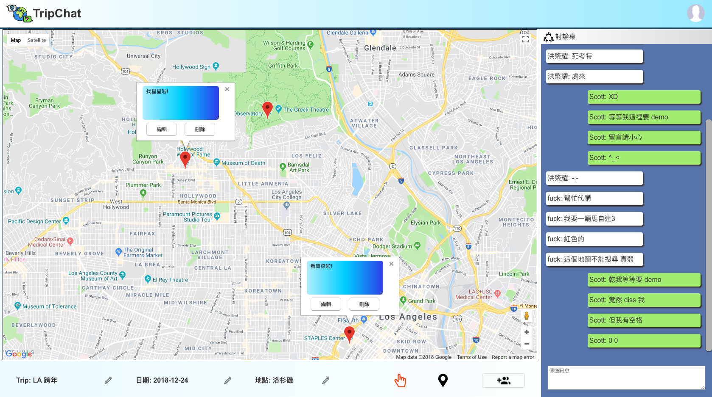
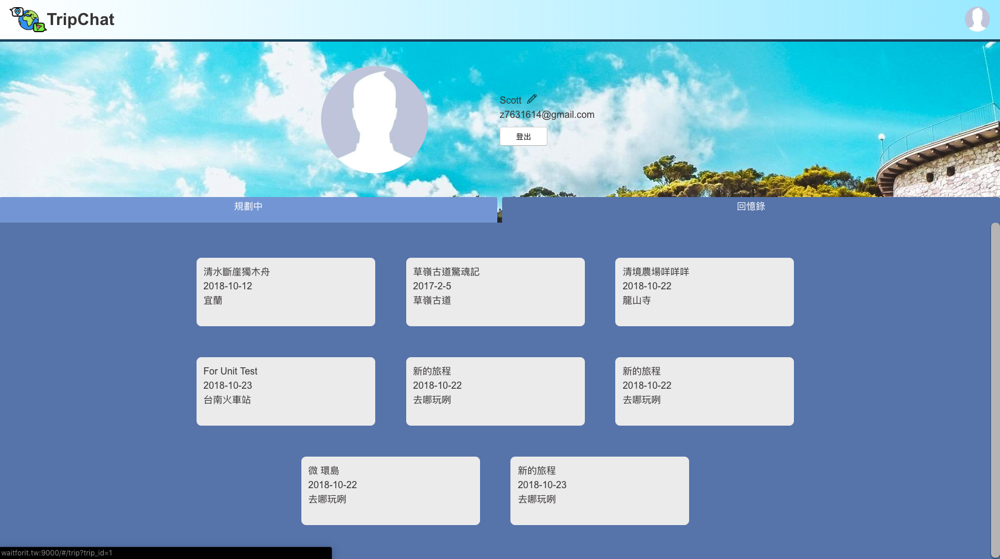

# TripChat
A real-time chat room with a map editor to draw up your trip scheme.

[Stop Talking, Start Planning](https://waitforit.tw)

* **Test User**: aaa@gmail.com
* **Password**: 1qaz2wsx

## Technologies
* **Backend**
    * Language: Node.js
    * Library & Framework: Express / Socket.IO
    * Database & Cache: MySQL / Redis
    * Unit Test: Mocha
    * Server Load Test: Artillery
    * Cloud service: AWS EC2
    * Container: Docker
* **Front-End**
    * Language: HTML / CSS / JavaScript
    * Library & Framework: React
    * Module Bundler: Webpack

## Features
* **Realtime Chat Room & Map Marker Editor**
* **Redirect current location of map by changing "Location" input**
 
* **Trip Records in Profile Page**
 
* **Login by email**

## Contact
**CY-Chang**
**z7631614@gmail.com**
